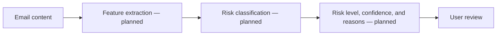

# SpamShield — Email Risk Analysis Concept

<strong>A project concept for analyzing an email and explaining signals that may indicate spam or phishing.</strong>

## Intended workflow

This is a conceptual workflow. The repository currently contains project copy and GitHub support files, but no classifier implementation, setup guide, or runnable app source.

## Before presenting it as runnable

Add the application and evaluation data, explain how email text is stored or discarded, and test false positives as well as spam detection. Do not use an unvalidated score as the sole reason to open, block, or delete a message.
